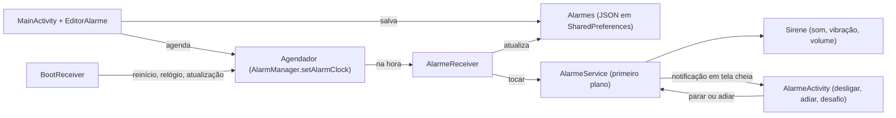

# Alarme Implacável

App Android de despertador feito pra ser impossível de ignorar. Ele toma a tela mesmo com o celular bloqueado e toca em loop no volume de alarme, inclusive no modo silencioso. Também trava o volume no máximo e pode exigir uma conta de matemática pra desligar.

- **Linguagem:** Kotlin com Jetpack Compose (Material 3), sem bibliotecas além do AndroidX.
- **Testado em:** Galaxy S24 FE (SM-S721B), Android 16 / One UI 8.5.
- **Idioma:** código, nomes e textos em português do Brasil.

## O que o app faz

| Recurso | Como funciona | Onde está |
|---|---|---|
| Toca no minuto exato | `AlarmManager.setAlarmClock`, que ignora a economia de bateria (Doze) | `Agendador.kt` |
| Toma a tela, mesmo bloqueada | Notificação com `fullScreenIntent` abre uma Activity com `showWhenLocked` e `turnScreenOn` | `AlarmeService.kt`, `AlarmeActivity.kt` |
| Toca no silencioso e passa pelo Não Perturbe | `MediaPlayer` e vibração com `USAGE_ALARM` | `Sirene.kt` |
| Volume travado no máximo (opcional) | A cada 1 s, restaura o volume de alarme se alguém abaixar | `Sirene.kt` |
| Pausa música e vídeo | Foco de áudio `AUDIOFOCUS_GAIN_TRANSIENT` | `Sirene.kt` |
| Desafio pra desligar (opcional) | Conta de somar com teclado próprio, que funciona na tela de bloqueio | `AlarmeActivity.kt` |
| Notificação que não some | `setDeleteIntent` reexibe a notificação se o usuário arrastar (Android 14+) | `AlarmeService.kt` |
| Botões de volume não calam | `onKeyDown` consome volume-baixo e mudo | `AlarmeActivity.kt` |
| Soneca de 5 min | Gravada no alarme (`sonecaAte`), aparece na tela e sobrevive a reinício | `Agendador.kt`, `Cartoes.kt` |
| Soneca automática | Sem resposta em 10 min, adia sozinho | `AlarmeService.kt` |
| Sobrevive a reinício | Reagenda no boot, inclusive antes do 1º desbloqueio (direct boot) | `BootReceiver.kt`, `Alarmes.kt` |
| Repetição por dia da semana | `dias` usa `DayOfWeek.value` (1 = seg … 7 = dom) | `Alarme.kt` |
| Checklist de permissões | Mostra o que falta e abre a tela certa das Configurações | `Poderes.kt`, `Cartoes.kt` |

## Como compilar e instalar

Requisitos:

- JDK 17 ou mais novo.
- Android SDK com `platforms;android-37.0` e `platform-tools`.
- Celular com Depuração USB ligada.

```bash
./gradlew testDebugUnitTest   # testes das regras de horário e dos textos
./gradlew assembleRelease     # gera app/build/outputs/apk/release/app-release.apk
./gradlew lintDebug           # deve terminar com 0 erros
./instalar.sh                 # compila, instala e abre no celular conectado por adb
```

- O APK de release é assinado com a chave de debug (`~/.android/debug.keystore`). Isso basta pra uso pessoal. Pra instalar por cima, é preciso a mesma chave; sem ela, desinstale antes.
- No Brasil, a partir de 30/09/2026, APK instalado por arquivo em celular certificado precisa ser de desenvolvedor verificado. Instalar via `adb` (o `instalar.sh`) continua liberado.

## Arquitetura

Fluxo de um alarme, do cadastro até tocar:



Estado compartilhado, sem ViewModel, injeção de dependência ou banco de dados. Tudo roda na thread principal:

- `Alarmes.lista` (`StateFlow<List<Alarme>>`) é a lista salva. A tela observa; receivers e serviço leem e gravam.
- `AlarmeService.tocando` (`StateFlow<Alarme?>`) é o alarme tocando agora. A `AlarmeActivity` fecha sozinha quando vira `null`.

Ciclo de vida de um disparo:

1. `Agendador.agendar` cria um `PendingIntent` de broadcast. O código é `id * 2` pro disparo normal e `id * 2 + 1` pra soneca, pra um não substituir o outro.
2. `AlarmeReceiver` recebe e atualiza o alarme salvo:
   - soneca: limpa `sonecaAte`;
   - alarme de uma vez só: `ativo = false`;
   - alarme repetido: agenda a próxima repetição.

   Depois chama `AlarmeService.tocar`.
3. `AlarmeService` vira serviço em primeiro plano (`specialUse`), mostra a notificação e liga a `Sirene`.
4. Com a tela desligada ou bloqueada, o sistema abre a `AlarmeActivity`. Com o celular em uso, aparece a notificação (na Samsung, primeiro a borda iluminada, depois a tela cheia).
5. Desligar (`parar`) ou adiar (`adiar`) encerram o serviço; a limpeza acontece em `onDestroy`.

## Mapa dos arquivos

Código em `app/src/main/java/com/implacavel/alarme/`. Cada arquivo começa com um comentário dizendo o que faz.

| Arquivo | Responsabilidade |
|---|---|
| `App.kt` | Início do processo: carrega os alarmes e cria o canal de notificação |
| `Alarme.kt` | Modelo e regras de quando toca (`proximoDisparo`, `proximoToque`, `sonecaPendente`), mais o JSON |
| `Alarmes.kt` | Repositório: lista em memória + gravação no armazenamento protegido pelo dispositivo |
| `Agendador.kt` | AlarmManager: agendar, soneca, cancelar, reagendar tudo |
| `AlarmeReceiver.kt` | Recebe o disparo, atualiza o alarme salvo e chama o serviço |
| `BootReceiver.kt` | Reagenda depois de reiniciar, mudar relógio/fuso ou atualizar o app |
| `AlarmeService.kt` | Serviço em primeiro plano: notificação, comandos (`tocar`, `parar`, `adiar`, `reexibir`), soneca automática |
| `Sirene.kt` | Som em loop, vibração, foco de áudio e trava de volume |
| `Notificacoes.kt` | Canal "Alarme tocando" (mudo de propósito; o som vem da `Sirene`) |
| `Poderes.kt` | Permissões necessárias: checagem e tela das Configurações de cada uma |
| `AlarmeActivity.kt` | Tela do alarme tocando, desafio e teclado numérico |
| `MainActivity.kt` | Tela principal: estado, pedido de permissão, lista |
| `Cartoes.kt` | Cabeçalho, cartão de permissões e cartão de cada alarme |
| `EditorAlarme.kt` | Diálogo de criar e editar alarme |
| `Formatacao.kt` | Textos de hora e dias (funções puras) |
| `Tema.kt` | Cores claras e escuras |

Outros arquivos:

- `app/src/main/AndroidManifest.xml`: permissões e componentes. Os do caminho do alarme têm `directBootAware`.
- `app/src/main/res/raw/alarme_reserva.wav`: bipes usados se o toque do sistema não puder ser lido (ex.: antes do primeiro desbloqueio).
- `app/src/test/java/com/implacavel/alarme/`: `AlarmeTest` (regras de horário) e `FormatacaoTest` (textos).
- `instalar.sh`: compila, instala e abre no celular via `adb`.

## Decisões de projeto (leia antes de mudar)

- **`setAlarmClock` e não `setExact`.** É o único agendamento que o Android trata como despertador. Ele ignora o Doze, libera iniciar serviço em segundo plano e mostra o ícone de alarme na barra. A permissão `USE_EXACT_ALARM` é concedida na instalação; a Play Store só aceita em apps de despertador, mas este app não depende da Play.
- **Som na `Sirene`, não no canal de notificação.** Som de canal para quando o usuário abre a gaveta de notificações e não permite travar o volume. `MediaPlayer` com `USAGE_ALARM` toca no volume de alarme, ignora o modo silencioso e só para quando o usuário desliga.
- **Serviço de primeiro plano `specialUse`.** Mantém o processo vivo enquanto toca. O Android 14+ exige um tipo, e `specialUse` é o tipo genérico.
- **Armazenamento protegido pelo dispositivo + `directBootAware`.** O alarme toca mesmo se o celular reiniciou e ninguém desbloqueou.
- **Canal com `IMPORTANCE_HIGH` e categoria `ALARM`.** Necessário pra tela cheia e pra passar pelo Não Perturbe quando alarmes estão permitidos (o padrão).
- **Sem arquitetura pesada.** São poucos dados, então há singletons com `StateFlow`, JSON em `SharedPreferences` e nenhuma thread extra.
- **`targetSdk = 36`.** Foi testado no Android 16. Subir pra 37 exige revisar as mudanças de comportamento do Android 17.

## Permissões

| Permissão | Pra quê | Como é concedida |
|---|---|---|
| `POST_NOTIFICATIONS` | Mostrar a notificação e a tela cheia | Pedido do sistema na 1ª abertura |
| `USE_EXACT_ALARM` / `SCHEDULE_EXACT_ALARM` (Android 12) | `setAlarmClock` | Automática (Android 13+) / Configurações |
| `USE_FULL_SCREEN_INTENT` | Tomar a tela | Automática fora da Play; conferida em `Poderes` |
| `FOREGROUND_SERVICE` + `FOREGROUND_SERVICE_SPECIAL_USE` | `AlarmeService` | Automática |
| `WAKE_LOCK`, `VIBRATE` | Manter o processador acordado e vibrar | Automática |
| `RECEIVE_BOOT_COMPLETED` | `BootReceiver` | Automática |
| `REQUEST_IGNORE_BATTERY_OPTIMIZATIONS` | Botão "Bateria sem restrição" | Diálogo do sistema |

## Limitações conhecidas

- "Forçar parada" nas Configurações faz o Android cancelar os alarmes até o app ser aberto de novo.
- Se o Não Perturbe estiver configurado pra bloquear alarmes, o som não passa (o app não pede acesso ao Não Perturbe).
- Na Samsung, o app não pode estar em "Apps em suspensão" (a tela principal avisa).
- Sonecas do botão "Testar agora" não são gravadas.

## Versões

| Item | Versão |
|---|---|
| Android Gradle Plugin | 9.4.1 (com Kotlin embutido, 2.2.10) |
| Gradle | 9.6.1 (wrapper) |
| JDK | 17+ (testado com 21) |
| compileSdk / targetSdk / minSdk | 37 / 36 / 26 |
| Compose BOM | 2026.09.00 |
| AndroidX core / activity-compose / lifecycle | 1.19.1 / 1.13.0 / 2.11.0 |

## Convenções pra quem for mexer (pessoa ou IA)

- Um arquivo por responsabilidade, com nome em português que diz o que faz.
- Regras de horário ficam em Kotlin puro (`Alarme.kt`, `Formatacao.kt`) e têm teste. Mexeu nelas? Rode `./gradlew testDebugUnitTest`.
- Antes de subir mudança: `./gradlew assembleRelease lintDebug testDebugUnitTest`, com 0 erros de lint.
- `Alarme.ID_TESTE = 0` é reservado pro botão "Testar agora"; alarmes salvos começam em 1.
- Imports explícitos, sem curinga.
