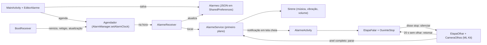

# Alarme Implacável

App Android de despertador feito pra ser impossível de ignorar. Ele toma a tela mesmo com o celular bloqueado e toca a sua música em loop no volume de alarme, inclusive no modo silencioso. Pra desligar, é preciso cumprir uma missão: **dizer "STOP"** e depois **olhar pra câmera de olhos abertos** até completar um anel.

- **Linguagem:** Kotlin com Jetpack Compose (Material 3). Câmera com CameraX; rosto e olhos com ML Kit, no próprio aparelho.
- **Testado em:** Galaxy S24 FE (SM-S721B), Android 16 / One UI 8.5.
- **Idioma:** código, nomes e textos em português do Brasil.

## O que o app faz

| Recurso | Como funciona | Onde está |
|---|---|---|
| Toca no minuto exato | `AlarmManager.setAlarmClock`, que ignora a economia de bateria (Doze) | `Agendador.kt` |
| Toma a tela, mesmo bloqueada | Notificação com `fullScreenIntent` abre uma Activity com `showWhenLocked` e `turnScreenOn` | `AlarmeService.kt`, `AlarmeActivity.kt` |
| Música escolhida pelo usuário | Arquivo de áudio do celular (seletor do sistema + permissão persistente); sem escolha, toque de alarme | `Ajustes.kt`, `Sirene.kt` |
| Toca no silencioso e passa pelo Não Perturbe | `MediaPlayer` e vibração com `USAGE_ALARM` | `Sirene.kt` |
| Missão, etapa 1: dizer STOP | Reconhecedor de voz do sistema em loop; a música alterna 5 s alta e 4 s a 25% pra voz ser ouvida | `OuvinteStop.kt`, `Missao.kt` |
| Missão, etapa 2: olhar pra câmera | Câmera frontal num círculo com anel de progresso: enche olhando de olhos abertos, esvazia 2× mais rápido sem olhar | `CameraOlhos.kt`, `Missao.kt` |
| Feedback visual da câmera | Anel e texto verde (olhando), âmbar (de lado) ou vermelho (olhos fechados, sem rosto); tela clara no brilho máximo pra iluminar o rosto | `Missao.kt`, `AlarmeActivity.kt` |
| Não dá pra enrolar | 20 s sem olhar pra câmera: a música volta e a missão recomeça | `Missao.kt` |
| Volume travado no máximo (opcional) | A cada 1 s, restaura o volume de alarme se alguém abaixar | `Sirene.kt` |
| Pausa música e vídeo de outros apps | Foco de áudio `AUDIOFOCUS_GAIN_TRANSIENT` | `Sirene.kt` |
| Notificação que não some | `setDeleteIntent` reexibe a notificação se o usuário arrastar (Android 14+) | `AlarmeService.kt` |
| Botões de volume não calam | `onKeyDown` consome volume-baixo e mudo | `AlarmeActivity.kt` |
| Soneca de 5 min | Gravada no alarme (`sonecaAte`), aparece na tela e sobrevive a reinício | `Agendador.kt`, `Cartoes.kt` |
| Soneca automática | Sem desligar em 10 min, adia sozinho | `AlarmeService.kt` |
| Sobrevive a reinício | Reagenda no boot, inclusive antes do 1º desbloqueio (direct boot) | `BootReceiver.kt`, `Alarmes.kt` |
| Repetição por dia da semana | `dias` usa `DayOfWeek.value` (1 = seg … 7 = dom) | `Alarme.kt` |
| Checklist de permissões | Mostra o que falta e pede no diálogo do sistema ou abre a tela certa das Configurações | `Poderes.kt`, `Cartoes.kt` |

## Como compilar e instalar

Requisitos:

- JDK 17 ou mais novo.
- Android SDK com `platforms;android-37.0` e `platform-tools`.
- Celular ARM com Depuração USB ligada.

```bash
./gradlew testDebugUnitTest   # testes das regras de horário, textos e missão
./gradlew assembleRelease     # gera app/build/outputs/apk/release/app-release.apk (~20 MB)
./gradlew lintDebug           # deve terminar com 0 erros
./instalar.sh                 # compila, instala e abre no celular conectado por adb
```

- O APK de release é assinado com a chave de debug (`~/.android/debug.keystore`). Isso basta pra uso pessoal. Pra instalar por cima, é preciso a mesma chave; sem ela, desinstale antes.
- No Brasil, a partir de 30/09/2026, APK instalado por arquivo em celular certificado precisa ser de desenvolvedor verificado. Instalar via `adb` (o `instalar.sh`) continua liberado.

## Arquitetura

Fluxo de um alarme, do cadastro até desligar:



Estado compartilhado, sem ViewModel, injeção de dependência ou banco de dados. Tudo roda na thread principal, exceto a análise dos quadros da câmera:

- `Alarmes.lista` (`StateFlow<List<Alarme>>`) é a lista salva. A tela observa; receivers e serviço leem e gravam.
- `Ajustes.musica` (`StateFlow<Musica?>`) é a música escolhida (URI + nome).
- `AlarmeService.tocando` (`StateFlow<Alarme?>`) é o alarme ativo agora. A `AlarmeActivity` fecha sozinha quando vira `null`.

Ciclo de vida de um disparo:

1. `Agendador.agendar` cria um `PendingIntent` de broadcast. O código é `id * 2` pro disparo normal e `id * 2 + 1` pra soneca, pra um não substituir o outro.
2. `AlarmeReceiver` recebe e atualiza o alarme salvo:
   - soneca: limpa `sonecaAte`;
   - alarme de uma vez só: `ativo = false`;
   - alarme repetido: agenda a próxima repetição.

   Depois chama `AlarmeService.tocar`.
3. `AlarmeService` vira serviço em primeiro plano (`specialUse`), mostra a notificação e liga a `Sirene`.
4. Com a tela desligada ou bloqueada, o sistema abre a `AlarmeActivity`. Com o celular em uso, aparece a notificação (na Samsung, primeiro a borda iluminada, depois a tela cheia).
5. Com `missao = true`, a tela faz a missão:
   - **FALAR:** a `EtapaFalar` alterna o volume da música via `AlarmeService.volume` e escuta com `OuvinteStop`. Ao ouvir "stop", chama `AlarmeService.silenciar`: a música para, mas o serviço e a notificação continuam.
   - **OLHAR:** a `EtapaOlhar` abre a `CameraOlhos` e enche o anel. Anel completo chama `AlarmeService.parar`. 20 s sem olhar chama `AlarmeService.retomar` e volta pro FALAR.

   Com `missao = false`, aparece só o botão DESLIGAR.
6. Parar ou adiar encerra o serviço; a limpeza acontece em `onDestroy`.

## Mapa dos arquivos

Código em `app/src/main/java/com/implacavel/alarme/`. Cada arquivo começa com um comentário dizendo o que faz.

| Arquivo | Responsabilidade |
|---|---|
| `App.kt` | Início do processo: carrega alarmes e ajustes e cria o canal de notificação |
| `Alarme.kt` | Modelo e regras de quando toca (`proximoDisparo`, `proximoToque`, `sonecaPendente`), mais o JSON |
| `Alarmes.kt` | Repositório: lista em memória + gravação no armazenamento protegido pelo dispositivo |
| `Ajustes.kt` | Música do alarme escolhida pelo usuário |
| `Agendador.kt` | AlarmManager: agendar, soneca, cancelar, reagendar tudo |
| `AlarmeReceiver.kt` | Recebe o disparo, atualiza o alarme salvo e chama o serviço |
| `BootReceiver.kt` | Reagenda depois de reiniciar, mudar relógio/fuso ou atualizar o app |
| `AlarmeService.kt` | Serviço em primeiro plano: notificação, comandos (`tocar`, `parar`, `adiar`, `reexibir`, `silenciar`, `retomar`, `volume`), soneca automática |
| `Sirene.kt` | Música em loop, vibração, foco de áudio, volume relativo e trava de volume |
| `Notificacoes.kt` | Canal "Alarme tocando" (mudo de propósito; o som vem da `Sirene`) |
| `Poderes.kt` | Permissões necessárias: checagem, diálogo do sistema ou tela das Configurações |
| `AlarmeActivity.kt` | Tela do alarme: relógio, etapa da missão (ou DESLIGAR), adiar, brilho máximo na etapa da câmera |
| `Missao.kt` | Etapas FALAR e OLHAR da missão, anel de progresso e textos de feedback |
| `OuvinteStop.kt` | Reconhecimento de voz contínuo até ouvir "stop" |
| `CameraOlhos.kt` | Câmera frontal (CameraX) + detecção de rosto (ML Kit) → `Leitura` a cada quadro |
| `RegrasMissao.kt` | Regras puras da missão: `disseStop`, `classificarRosto`, `avancarOlhar`, tempos |
| `MainActivity.kt` | Tela principal: estado, pedidos de permissão, seletor de música, lista |
| `Cartoes.kt` | Cabeçalho, cartão de permissões, cartão da música e cartão de cada alarme |
| `EditorAlarme.kt` | Diálogo de criar e editar alarme |
| `Formatacao.kt` | Textos de hora e dias (funções puras) |
| `Tema.kt` | Cores claras e escuras |

Outros arquivos:

- `app/src/main/AndroidManifest.xml`: permissões, `queries` do reconhecimento de voz e componentes. Os do caminho do alarme têm `directBootAware`.
- `app/src/main/res/raw/alarme_reserva.wav`: bipes usados se nem a música nem o toque do sistema puderem ser lidos (ex.: antes do primeiro desbloqueio).
- `app/src/test/java/com/implacavel/alarme/`: `AlarmeTest` (horários), `FormatacaoTest` (textos) e `MissaoTest` (voz, rosto e anel).
- `instalar.sh`: compila, instala e abre no celular via `adb`.

## Decisões de projeto (leia antes de mudar)

- **`setAlarmClock` e não `setExact`.** É o único agendamento que o Android trata como despertador. Ele ignora o Doze, libera iniciar serviço em segundo plano e mostra o ícone de alarme na barra. A permissão `USE_EXACT_ALARM` é concedida na instalação; a Play Store só aceita em apps de despertador, mas este app não depende da Play.
- **Som na `Sirene`, não no canal de notificação.** Som de canal para quando o usuário abre a gaveta de notificações e não permite travar nem variar o volume. `MediaPlayer` com `USAGE_ALARM` toca no volume de alarme, ignora o modo silencioso e só para por comando do serviço.
- **O app não traz música.** A música do alarme é um arquivo que o usuário escolhe no celular, porque música comercial tem direitos autorais e o repositório é público.
- **Voz e música no mesmo celular.** Com a música alta no alto-falante, o microfone ouve mais a música que a pessoa. Por isso a etapa FALAR alterna 5 s de música alta (pra acordar) com 4 s a 25% (janela de escuta, com o aviso "🎤 Fala agora!"). O reconhecedor escuta o tempo todo.
- **"Stop" com sotaque.** `disseStop` aceita "stop", "estop", "istópi", "stopi" etc., em qualquer ponto da frase, sem acento. O reconhecedor usa o idioma do sistema e prefere o modo offline.
- **Olhar = rosto de frente + dois olhos abertos.** Giro de até 20°, probabilidade de olho aberto do ML Kit acima de 60%. É detecção de rosto, **não** reconhecimento de quem é: qualquer rosto serve.
- **ML Kit com modelo embutido**, e não o baixado pelo Google Play Services: funciona offline e antes do primeiro desbloqueio. Custa ~8 MB por tipo de processador, por isso o APK só inclui ARM (`abiFilters`).
- **Sempre há saída.** Sem microfone ou reconhecimento de voz, a etapa FALAR mostra "PARAR A MÚSICA". Sem câmera, a etapa OLHAR mostra "DESLIGAR". Um alarme que não desliga nunca seria pior.
- **Serviço de primeiro plano `specialUse`.** Mantém o processo vivo enquanto o alarme dura. Microfone e câmera são usados pela Activity visível, não pelo serviço.
- **Armazenamento protegido pelo dispositivo + `directBootAware`.** O alarme toca mesmo se o celular reiniciou e ninguém desbloqueou.
- **Canal com `IMPORTANCE_HIGH` e categoria `ALARM`.** Necessário pra tela cheia e pra passar pelo Não Perturbe quando alarmes estão permitidos (o padrão).
- **Sem arquitetura pesada.** São poucos dados, então há singletons com `StateFlow`, JSON em `SharedPreferences` e nenhuma thread extra além da análise da câmera.
- **`targetSdk = 36`.** Foi testado no Android 16. Subir pra 37 exige revisar as mudanças de comportamento do Android 17.

## Permissões

| Permissão | Pra quê | Como é concedida |
|---|---|---|
| `POST_NOTIFICATIONS` | Mostrar a notificação e a tela cheia | Diálogo do sistema na 1ª abertura |
| `RECORD_AUDIO` | Ouvir o "stop" | Diálogo, pelo botão "Liberar" |
| `CAMERA` | Ver os olhos abertos | Diálogo, pelo botão "Liberar" |
| `USE_EXACT_ALARM` / `SCHEDULE_EXACT_ALARM` (Android 12) | `setAlarmClock` | Automática (Android 13+) / Configurações |
| `USE_FULL_SCREEN_INTENT` | Tomar a tela | Automática fora da Play; conferida em `Poderes` |
| `FOREGROUND_SERVICE` + `FOREGROUND_SERVICE_SPECIAL_USE` | `AlarmeService` | Automática |
| `WAKE_LOCK`, `VIBRATE` | Manter o processador acordado e vibrar | Automática |
| `RECEIVE_BOOT_COMPLETED` | `BootReceiver` | Automática |
| `REQUEST_IGNORE_BATTERY_OPTIMIZATIONS` | Botão "Bateria sem restrição" | Diálogo do sistema |

## Limitações conhecidas

- "Forçar parada" nas Configurações faz o Android cancelar os alarmes até o app ser aberto de novo.
- Se o Não Perturbe estiver configurado pra bloquear alarmes, o som não passa (o app não pede acesso ao Não Perturbe).
- Na Samsung, o app não pode estar em "Apps em suspensão" (a tela principal avisa).
- Antes do primeiro desbloqueio depois de reiniciar, a música escolhida e o reconhecimento de voz podem não estar disponíveis: tocam os bipes e aparece o botão "PARAR A MÚSICA".
- Com a tela desbloqueada e o app em segundo plano (botão Home), o Android corta o microfone; ao voltar pra tela do alarme, o reconhecimento pode ter caído pro botão.
- Sonecas do botão "Testar agora" não são gravadas.
- **Fique de olho:** o Android 16 (Galaxy S24 FE) registra avisos "AudioHardening … would be muted" quando o alarme toca com o app em segundo plano. Hoje é só auditoria: o som toca normalmente, e isso foi conferido no `dumpsys audio`. Se uma versão futura passar a aplicar a regra, o candidato é trocar o tipo do `AlarmeService` de `specialUse` para `mediaPlayback`. Pra conferir, rode `adb shell dumpsys audio | grep -A5 "Hardening enforcement"` depois de um alarme tocar com a tela bloqueada.

## Versões

| Item | Versão |
|---|---|
| Android Gradle Plugin | 9.4.1 (com Kotlin embutido, 2.2.10) |
| Gradle | 9.6.1 (wrapper) |
| JDK | 17+ (testado com 21) |
| compileSdk / targetSdk / minSdk | 37 / 36 / 26 |
| Compose BOM | 2026.09.00 |
| AndroidX core / activity-compose / lifecycle | 1.19.1 / 1.13.0 / 2.11.0 |
| CameraX | 1.6.2 |
| ML Kit face-detection (modelo embutido) | 16.1.7, sob os termos do ML Kit do Google |

## Convenções pra quem for mexer (pessoa ou IA)

- Um arquivo por responsabilidade, com nome em português que diz o que faz.
- Regras ficam em Kotlin puro (`Alarme.kt`, `Formatacao.kt`, `RegrasMissao.kt`) e têm teste. Mexeu nelas? Rode `./gradlew testDebugUnitTest`.
- Tempos e limiares da missão ficam nas constantes do topo de `RegrasMissao.kt` e `Missao.kt`.
- Antes de subir mudança: `./gradlew assembleRelease lintDebug testDebugUnitTest`, com 0 erros de lint.
- `Alarme.ID_TESTE = 0` é reservado pro botão "Testar agora"; alarmes salvos começam em 1.
- Imports explícitos, sem curinga.
