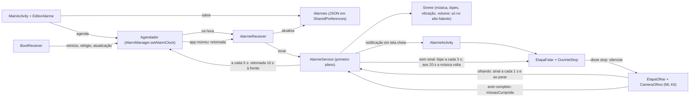

# Alarme Implacável

App Android de despertador feito pra ser impossível de ignorar. Ele toma a tela mesmo com o celular bloqueado e toca a sua música em loop no volume de alarme, inclusive no modo silencioso. Pra desligar, é preciso cumprir uma missão: **dizer "STOP"** e depois **olhar pra câmera de olhos abertos** por 20 minutos, até completar um anel. Depois que tocou, não há outra saída: nem adiar, nem pausa, nem desligar o celular, nem o app cair.

- **Linguagem:** Kotlin com Jetpack Compose (Material 3). Câmera com CameraX; rosto e olhos com ML Kit, no próprio aparelho.
- **Testado em:** Galaxy S24 FE (SM-S721B), Android 16 / One UI 8.5.
- **Idioma:** código, nomes e textos em português do Brasil.

## O que o app faz

| Recurso | Como funciona | Onde está |
|---|---|---|
| Toca no minuto exato | `AlarmManager.setAlarmClock`, que ignora a economia de bateria (Doze) | `Agendador.kt` |
| Toma a tela, mesmo bloqueada | Notificação com `fullScreenIntent` abre uma Activity com `showWhenLocked` e `turnScreenOn` | `AlarmeService.kt`, `AlarmeActivity.kt` |
| Música escolhida pelo usuário | Arquivo de áudio do celular (seletor do sistema + permissão persistente); sem escolha, toque de alarme | `Ajustes.kt`, `Sirene.kt` |
| Toca no silencioso e passa pelo Não Perturbe | `MediaPlayer` e vibração com `USAGE_ALARM` | `Sirene.kt` |
| Missão, etapa 1: dizer STOP | Reconhecedor de voz do sistema em loop; a música alterna 5 s alta e 4 s a 25% pra voz ser ouvida | `OuvinteStop.kt`, `Missao.kt` |
| Missão, etapa 2: olhar pra câmera | Câmera frontal num círculo com anel de progresso, que enche em 20 min de olhos abertos (30 s no botão de teste). Só anda enquanto o quadro atual mostra olhos abertos; sem isso, para na hora e nunca desce. Câmera travada (sem quadro novo há 1 s) conta como sem rosto | `CameraOlhos.kt`, `Missao.kt`, `RegrasMissao.kt` |
| Feedback visual da câmera | Anel e texto verde (olhando), âmbar (de lado) ou vermelho (olhos fechados, sem rosto), o tempo que falta ("Mais 19:42") e a contagem pra zerar; tela clara no brilho máximo pra iluminar o rosto | `Missao.kt`, `AlarmeActivity.kt` |
| Não dá pra enrolar | Parou de olhar: aos 3 s a tela mostra "17 s pra zerar" e toca um bipe; a cada 3 s, outro bipe, mais alto. Aos 20 s, a música volta e a missão recomeça, com o anel zerado (a vigia fica no serviço) | `AlarmeService.kt`, `Missao.kt`, `RegrasMissao.kt` |
| Só no alto-falante do celular | Música e bipes com `MediaPlayer.setPreferredDevice` no alto-falante embutido: com fone ou Bluetooth conectado, o alarme não vai pra eles (Android 9+) | `Sirene.kt` |
| Fechar a tela não adianta | Home, arrastar o app ou apagar a tela com o alarme ativo: em 1 s a música volta e uma nova notificação em tela cheia reabre o alarme (no Galaxy S24 FE, 1,3 a 3,6 s no total). Na etapa da câmera, o anel fica onde estava: depois do STOP, continua dali | `AlarmeActivity.kt`, `AlarmeService.kt` |
| O app cair não adianta | Enquanto toca, o serviço deixa no AlarmManager (que roda fora do app) uma retomada sempre 10 s à frente. Se o app cair, travar ou for encerrado, o Android religa o alarme sozinho | `AlarmeService.kt`, `Agendador.kt`, `App.kt` |
| Desligar o celular não adianta | O alarme em andamento fica gravado até ser cumprido; quando o processo volta (celular ligado de novo, app reaberto), ele toca de novo em poucos segundos | `Ajustes.kt`, `App.kt` |
| Sem saída | Sem adiar, pausa ou soneca. O alarme que tocou vira uma "foto" gravada, com a música e o volume: editar, desligar ou excluir o alarme, trocar a música ou abaixar o volume no meio não muda nada. Tirar a permissão da câmera mostra "LIBERAR CÂMERA", não "DESLIGAR". Dois alarmes ao mesmo tempo viram um, com a exigência maior; alarme de verdade no meio do teste toma o lugar dele, com as regras dele (20 min) | `AlarmeReceiver.kt`, `AlarmeService.kt`, `Alarme.kt`, `Missao.kt` |
| Volume travado | Do disparo até a missão cumprida (inclusive com a música calada depois do STOP), a cada 1 s desfaz qualquer tentativa de abaixar o volume de alarme: 70% com "Volume forte", 50% no botão de teste, ou o volume de antes do alarme, que volta no fim | `Sirene.kt`, `Alarme.kt` |
| Pausa música e vídeo de outros apps | Foco de áudio `AUDIOFOCUS_GAIN_TRANSIENT` do disparo até a missão cumprida, inclusive nos 20 min de câmera | `Sirene.kt` |
| Notificação que não some | `setDeleteIntent` reexibe a notificação se o usuário arrastar (Android 14+) | `AlarmeService.kt` |
| Botões de volume não calam | `onKeyDown` consome volume-baixo e mudo | `AlarmeActivity.kt` |
| Sobrevive a reinício | Reagenda no boot, inclusive antes do 1º desbloqueio (direct boot), e toda vez que o app é aberto (não ao girar a tela) | `BootReceiver.kt`, `MainActivity.kt`, `Alarmes.kt` |
| Repetição por dia da semana | `dias` usa `DayOfWeek.value` (1 = seg … 7 = dom) | `Alarme.kt` |
| Checklist de permissões | Mostra o que falta e pede no diálogo do sistema ou abre a tela certa das Configurações | `Poderes.kt`, `Cartoes.kt` |

## Como compilar e instalar

Requisitos:

- JDK 17 ou mais novo.
- Android SDK com `platforms;android-37.0` e `platform-tools`.
- Celular ARM com Depuração USB ligada.

```bash
./gradlew testDebugUnitTest   # testes das regras de horário, textos e missão
./gradlew assembleRelease     # gera app/build/outputs/apk/release/app-release.apk (~20 MB)
./gradlew lintDebug           # deve terminar com 0 erros
./instalar.sh                 # compila, instala e abre no celular conectado por adb
adb logcat -s Implacavel      # acompanha um alarme: disparo, som, o que a voz ouviu, o que a câmera vê
```

- O APK de release é assinado com a chave de debug (`~/.android/debug.keystore`). Isso basta pra uso pessoal. Pra instalar por cima, é preciso a mesma chave; sem ela, desinstale antes.
- No Brasil, a partir de 30/09/2026, APK instalado por arquivo em celular certificado precisa ser de desenvolvedor verificado. Instalar via `adb` (o `instalar.sh`) continua liberado.

## Arquitetura

Fluxo de um alarme, do cadastro até desligar:



Estado compartilhado, sem ViewModel, injeção de dependência ou banco de dados. Tudo roda na thread principal, exceto a análise dos quadros da câmera:

- `Alarmes.lista` (`StateFlow<List<Alarme>>`) é a lista salva. A tela observa; receivers e serviço leem e gravam.
- `Ajustes.musica` (`StateFlow<Musica?>`) é a música escolhida (URI + nome).
- `AlarmeService.tocando` (`StateFlow<Alarme?>`) é o alarme ativo agora. A `AlarmeActivity` fecha sozinha quando vira `null`.
- `AlarmeService.silenciado` (`StateFlow<Boolean>`) diz se a pessoa já disse "stop" (música calada). A tela deriva a etapa daqui: `false` = FALAR, `true` = OLHAR.
- `AlarmeService.ultimoOlhar` (`StateFlow<Long>`, `SystemClock.elapsedRealtime`) é quando chegou o último sinal de "olhando" (ou o "stop"). A vigia conta daqui os bipes e os 20 s, e a tela, a contagem pra zerar: um relógio só.
- `AlarmeService.olhado` (`StateFlow<Long>`) é o tempo de olhos abertos já somado no anel nesta rodada da câmera, que a tela manda junto com cada sinal de "olhando". Só zera nos 20 s sem olhar (e no fim do alarme): sair da tela traz a música de volta, mas depois do STOP a câmera continua daqui, e a tela recriada no meio também.
- `Ajustes.emAndamento` (`EmAndamento?`, gravado em JSON) é a foto do alarme que tocou e ainda não foi cumprido: o alarme, quando tocou, a música e o volume de antes. Só `AlarmeService.concluir` apaga.

Ciclo de vida de um disparo:

1. `Agendador.agendar` cria um `PendingIntent` de broadcast DISPARAR por alarme (código `id * 2`) e o agenda com `setAlarmClock`.
2. `AlarmeReceiver` recebe e atualiza o alarme salvo:
   - alarme desligado (agendamento velho): ignora;
   - alarme de uma vez só: `ativo = false`;
   - alarme repetido: agenda a próxima repetição.

   Depois grava a foto em `Ajustes.emAndamento` (se já havia uma, junta os dois com `EmAndamento.juntar`), arma a retomada e chama `AlarmeService.tocar`. Foto e retomada vêm antes do serviço: se o app cair daqui pra frente, o alarme volta.
3. `AlarmeService` lê a foto, vira serviço em primeiro plano (`specialUse`), mostra a notificação, liga a `Sirene` com a música e o volume da foto e passa a empurrar a retomada pra frente a cada 5 s.
4. Com a tela desligada ou bloqueada, o sistema abre a `AlarmeActivity`. Com o celular em uso, aparece a notificação (na Samsung, primeiro a borda iluminada, depois a tela cheia).
5. Com `missao = true`, a tela faz a missão (logo depois de o celular reiniciar, antes do primeiro desbloqueio, vem antes a etapa **DESBLOQUEAR**: a voz do Google só roda depois do desbloqueio, então o botão abre o teclado do PIN por cima do alarme):
   - **FALAR:** a `EtapaFalar` alterna o volume da música via `AlarmeService.volume` e escuta com `OuvinteStop`. Ao ouvir "stop", chama `AlarmeService.silenciar`: a música para, `silenciado` vira `true` e a vigia do serviço começa a contar. Se já havia tempo olhado (a pessoa saiu da tela no meio da câmera), mostra "Anel guardado: faltam 15:42".
   - **OLHAR:** a `EtapaOlhar` abre a `CameraOlhos` e enche o anel até somar `metaOlhar` (20 min; 30 s no teste) de olhos abertos, em tempo real. Enquanto a pessoa olha, chama `AlarmeService.olhando` a cada segundo, e uma vez no instante em que ela para; cada sinal zera a contagem da vigia. Sem olhar há 3 s, a tela mostra "N s pra zerar", contados de `AlarmeService.ultimoOlhar`. Anel completo chama `AlarmeService.missaoCumprida`.
   - **Vigia:** a cada 3 s sem sinal, um bipe mais alto que o anterior (`Sirene.bipe`, `volumeDoBipe`: o 1º a 12 dB abaixo do volume de alarme, subindo por igual até o 6º, no máximo). Aos 20 s sem sinal, zera o anel (`AlarmeService.olhado`) e religa a música e a notificação; `silenciado` volta a `false` e a tela, se estiver aberta, volta pro FALAR.

   Com `missao = false`, aparece só o botão DESLIGAR (`AlarmeService.desligar`, que o serviço só aceita em alarme sem missão).
6. Enquanto o alarme dura, a `AlarmeActivity` avisa o serviço em `onStart`/`onStop` (`AlarmeService.tela`). Se a tela sumir por 1 s, o serviço religa a música e posta uma segunda notificação em tela cheia (`Notificacoes.ID_CHAMADA`), que reabre a tela, inclusive com o celular bloqueado. O anel da câmera não zera por isso: depois do STOP, continua de onde parou.
7. Missão cumprida (`missaoCumprida` ou `desligar` → `concluir`) é o único fim: devolve o volume de antes, apaga a foto e cancela a retomada; a limpeza acontece em `onDestroy`. Se o processo morrer antes (queda, trava, "Forçar parada", celular desligado), a retomada dispara, ou o `App.onCreate` arma uma nova quando o processo volta, e o `AlarmeReceiver` põe a foto pra tocar de novo.

## Mapa dos arquivos

Código em `app/src/main/java/com/implacavel/alarme/`. Cada arquivo começa com um comentário dizendo o que faz.

| Arquivo | Responsabilidade |
|---|---|
| `App.kt` | Início do processo: carrega alarmes e ajustes, cria o canal de notificação e religa alarme interrompido. Também tem `TAG` (logs) e `prefsProtegidas` (armazenamento legível antes do 1º desbloqueio) |
| `Alarme.kt` | Modelo e regra de quando toca (`proximoDisparo`), `nome` pra mostrar e o JSON; e `EmAndamento`, a foto do alarme tocando, com `juntar` (dois alarmes viram um) |
| `Alarmes.kt` | Repositório: lista em memória + gravação no armazenamento protegido pelo dispositivo |
| `Ajustes.kt` | Música do alarme e a foto do alarme em andamento (`emAndamento`) |
| `Agendador.kt` | AlarmManager: `agendar` (próxima ocorrência), `agendarTeste`, `agendarRetomada`/`cancelarRetomada` (rede de segurança do alarme em andamento), reagendar tudo |
| `AlarmeReceiver.kt` | Recebe DISPARAR (atualiza o alarme salvo, grava a foto, arma a retomada e chama o serviço) e RETOMAR (põe o alarme em andamento pra tocar de novo) |
| `BootReceiver.kt` | Reagenda depois de reiniciar, mudar relógio/fuso ou atualizar o app |
| `AlarmeService.kt` | Serviço em primeiro plano: notificação, comandos (`tocar`, `missaoCumprida`, `desligar`, `reexibir`, `tela`, `silenciar`, `olhando`, `volume`, `darTempo`), vigia da missão, reabertura da tela, renovação da retomada, válvula de defeito e `concluir`, o único fim do alarme |
| `Sirene.kt` | Música em loop, bipes de aviso, vibração, foco de áudio, volume relativo e trava de volume do começo ao fim (`preparar`, `tocar`, `calar`, `bipe`, `desligar`); todo som sai no alto-falante do celular |
| `Notificacoes.kt` | Canal "Alarme tocando" (mudo de propósito; o som vem da `Sirene`) |
| `Poderes.kt` | `enum Poder`: cada permissão necessária sabe se está `liberado`, qual permissão de diálogo falta e abrir a tela certa das Configurações |
| `AlarmeActivity.kt` | Tela do alarme: relógio, etapa da missão (ou DESLIGAR), brilho máximo na etapa da câmera, aviso de tela aberta/fechada pro serviço, e se o celular já foi desbloqueado desde que ligou |
| `Missao.kt` | Etapas DESBLOQUEAR (só logo depois de reiniciar), FALAR e OLHAR, anel de progresso, tempo que falta, contagem pra zerar, textos de feedback e o pedido da câmera quando a permissão foi tirada (desbloqueio, diálogo ou Configurações com tempo de graça) |
| `OuvinteStop.kt` | Reconhecimento de voz contínuo até ouvir "stop"; desiste (e a tela mostra o botão) depois de 5 erros seguidos ou 8 s sem sinal do reconhecedor |
| `CameraOlhos.kt` | Câmera frontal (CameraX) + detecção de rosto (ML Kit) → `Leitura` a cada quadro; câmera com defeito → `SEM_CAMERA` |
| `RegrasMissao.kt` | Regras puras da missão: `disseStop`, `classificarRosto`, `metaOlhar`, `avancarOlhar`, `segundosParaZerar`, `volumeDoBipe` e os tempos |
| `MainActivity.kt` | Tela principal: estado, pedidos de permissão, seletor de música, lista. Reagenda tudo ao abrir |
| `Cartoes.kt` | Cabeçalho, cartão de permissões, cartão da música e cartão de cada alarme |
| `EditorAlarme.kt` | Diálogo de criar e editar alarme |
| `Formatacao.kt` | Textos de hora, dias e tempo que falta no anel (funções puras) |
| `Tema.kt` | Tema claro e escuro, cores fixas da tela do alarme (`VermelhoAlarme`, `VinhoAlarme`) e o relógio `agoraACada` |

Outros arquivos:

- `app/src/main/AndroidManifest.xml`: permissões, `queries` do reconhecimento de voz e componentes. Os do caminho do alarme têm `directBootAware`.
- `app/proguard-rules.pro`: mantém o ML Kit intacto na otimização do R8 (veja as decisões de projeto).
- `app/src/main/res/raw/alarme_reserva.wav`: bipes usados se nem a música nem o toque do sistema puderem ser lidos (ex.: antes do primeiro desbloqueio).
- `app/src/main/res/raw/bipe.wav`: "bi-bip" de aviso da etapa da câmera (2 kHz, 0,32 s), sintetizado pro app.
- `app/src/test/java/com/implacavel/alarme/`: `AlarmeTest` (horários, nome, JSON e alarme em andamento), `FormatacaoTest` (textos e tempo que falta) e `MissaoTest` (voz, rosto, anel, contagem pra zerar e bipes).
- `instalar.sh`: compila, instala e abre no celular via `adb`.

## Decisões de projeto (leia antes de mudar)

- **`setAlarmClock` e não `setExact`.** É o único agendamento que o Android trata como despertador. Ele ignora o Doze, libera iniciar serviço em segundo plano e mostra o ícone de alarme na barra. A permissão `USE_EXACT_ALARM` é concedida na instalação; a Play Store só aceita em apps de despertador, mas este app não depende da Play.
- **Som na `Sirene`, não no canal de notificação.** Som de canal para quando o usuário abre a gaveta de notificações e não permite travar nem variar o volume. `MediaPlayer` com `USAGE_ALARM` toca no volume de alarme, ignora o modo silencioso e só para por comando do serviço.
- **Som sempre no alto-falante do celular.** Com fone ou Bluetooth conectado, o Android toca alarme neles também (ou só neles), e um fone esquecido no criado-mudo não acorda ninguém. Cada `MediaPlayer` (música e bipe) recebe `setPreferredDevice` com o alto-falante embutido, depois do `setDataSource` (antes dele o MediaPlayer ignora a escolha). Antes do Android 9 o `MediaPlayer` não escolhe saída.
- **O app não traz música.** A música do alarme é um arquivo que o usuário escolhe no celular, porque música comercial tem direitos autorais e o repositório é público.
- **Voz e música no mesmo celular.** Com a música alta no alto-falante, o microfone ouve mais a música que a pessoa. Por isso a etapa FALAR alterna 5 s de música alta (pra acordar) com 4 s a 25% (janela de escuta, com o aviso "🎤 Fala agora!"). O reconhecedor escuta o tempo todo.
- **"Stop" com sotaque.** `disseStop` aceita "stop", "estop", "istópi", "stopi" etc., em qualquer ponto da frase, sem acento. O reconhecedor usa o idioma do sistema e prefere o modo offline.
- **Olhar = rosto de frente + dois olhos abertos.** Giro de até 25°, probabilidade de olho aberto do ML Kit acima de 60%. É detecção de rosto, **não** reconhecimento de quem é: qualquer rosto serve. O ML Kit roda no modo preciso e acha rosto a partir de 10% da largura da imagem: no modo rápido, com mínimo de 20%, o rosto sumia a cada 1 ou 2 s com o celular a um braço de distância (16 de 19 quedas do anel num teste foram "sem rosto").
- **O anel só anda com olhos abertos no quadro atual, e nunca volta** (`avancarOlhar`). Já houve tolerância a piscadas (o anel seguia crescendo por 1,5 s depois de o rosto sair, o que parecia câmera travada em quadros antigos) e regressão sem olhar (uma falha do detector derrubava o anel de 92%). O dono pediu os dois fora: parar na hora, sem regredir. Quadro velho também não conta: sem quadro novo há 1 s (câmera travada), a leitura vira "sem rosto".
- **20 minutos de câmera, 30 s no teste** (`metaOlhar`). Pra garantir que a pessoa acordou de verdade; o botão de teste é rápido de propósito. Com 20 min, o anel soma o tempo real entre duas conferências (somar 100 ms fixos a cada volta do laço atrasaria o relógio) e fica no serviço (`AlarmeService.olhado`), não na tela: a tela recriada no meio (ex.: o modo escuro do sistema mudou) continua de onde estava, e nada que ela guarde sozinha traz de volta um anel que já zerou (antes, com `rememberSaveable`, sair da tela e mudar o modo escuro devolvia o anel na rodada seguinte). Sair da tela traz a música de volta e pede o STOP de novo, mas não zera o anel (o dono pediu: com 20 min, uma ligação ou um toque sem querer no botão de início custariam tudo); só a regra dos 20 s sem olhar zera. Se um alarme de verdade dispara no meio do teste, `EmAndamento.juntar` troca o teste por ele, com as regras dele.
- **Contagem pra zerar e bipes no mesmo relógio.** Aos 3 s sem olhar a tela mostra "17 s pra zerar" e a vigia toca o 1º bipe; a cada 3 s, mais um, mais alto; aos 20 s, zera. A tela avisa o serviço a cada 1 s olhando e também no instante em que para, e os dois contam de `AlarmeService.ultimoOlhar`: o que a tela mostra bate com os bipes e com o zerar. O foco de áudio fica com o alarme até o fim, então a música de outro app não volta no meio da câmera e cobre os bipes.
- **Girar o celular não reinicia a missão.** A `AlarmeActivity` declara `configChanges`, então câmera e microfone seguem rodando. Antes, girar recriava a tela e voltava pro "diga STOP" com a música já calada.
- **Tocou, só sai cumprindo a missão.** Não há adiar, pausa nem soneca. O alarme que tocou vira uma foto em `Ajustes.emAndamento` (alarme, hora, música e volume de antes), que só `AlarmeService.concluir` apaga: editar, desligar ou excluir o alarme, trocar a música ou abaixar o volume no meio não muda nada. O DESLIGAR (`AlarmeService.desligar`) só vale pra alarme sem missão, então repetir o da notificação de outro alarme não adianta. Se outro alarme dispara no meio, os dois viram um, com a exigência maior (`EmAndamento.juntar`): um pré-alarme sem missão não engole o alarme com missão. Fechar a tela reabre ela em poucos segundos (o serviço posta uma notificação nova em tela cheia, `ID_CHAMADA`). Desligar o celular só adia até ele ligar.
- **O alarme em andamento não depende do app estar vivo.** Enquanto toca, o serviço empurra a cada 5 s uma retomada no AlarmManager pra 10 s à frente (`Agendador.agendarRetomada`), e o AlarmManager roda fora do app. Se o app cair, for encerrado (falta de memória, permissão tirada) ou travar, a retomada dispara e o `AlarmeReceiver` põe a foto pra tocar. Uma segunda retomada, 90 s depois, cobre o app travado: a primeira chega com ele travado e se perde. Quando o processo volta, o `App` arma a retomada pra 2 s. O `AlarmeReceiver` ignora retomada sem alarme em andamento (missão recém-cumprida) e disparo de alarme desligado (agendamento velho).
- **Defeito não pode prender ninguém.** Com o app caindo sem parar, o alarme nunca desligaria. O serviço conta as quedas pelo histórico de saídas do Android (`ApplicationExitInfo`: erro, erro nativo e travamento, Android 11+) desde que o alarme tocou. Numa queda só, o alarme volta com o desafio (o dono pediu). Na segunda, volta com o botão DESLIGAR. Preço: o Android para de religar em segundo plano um app que cai duas vezes em poucos minutos, então depois da segunda queda o alarme pode ficar mudo até o app ser aberto, e aí aparece com o DESLIGAR. Parar pelos "Apps ativos", tirar permissão, "Forçar parada" e falta de memória não são quedas, então não viram saída.
- **Antes do primeiro desbloqueio, a missão espera o desbloqueio.** Logo depois de reiniciar, o serviço de voz do Google cai (`Unable to create service GoogleTTSRecognitionService`) e a música escolhida não pode ser lida (toca o toque de alarme do sistema). Num teste, o reconhecedor ficou mudo, sem erro, e a tela do alarme cobria o teclado do PIN: não dava pra desligar nem desbloquear. Agora a etapa DESBLOQUEAR chama `requestDismissKeyguard` e dá 60 s sem a tela do alarme voltar (`darTempo`); e o `OuvinteStop` desiste depois de 8 s sem nenhum sinal do reconhecedor.
- **A vigia da missão fica no serviço, não na tela.** Num teste, dizer "stop" e fechar a tela do alarme deixava a música calada: a regra dos 20 s morria junto com a tela. Agora a etapa vem de `AlarmeService.silenciado`, a tela só manda sinais de "olhando", e é o serviço (que continua vivo) quem bipa e religa a música.
- **ML Kit com modelo embutido**, e não o baixado pelo Google Play Services: funciona offline e antes do primeiro desbloqueio. Custa ~8 MB por tipo de processador, por isso o APK só inclui ARM (`abiFilters`); o lint avisa da falta de x86 pra Chromebook, e isso é de propósito.
- **ML Kit precisa de regra no R8.** O ML Kit cria partes de si mesmo por reflexão. No modo completo do R8 (padrão do AGP 9), os construtores delas sumiam e `FaceDetection.getClient` quebrava com `NullPointerException` ao abrir a câmera. `app/proguard-rules.pro` mantém `com.google.mlkit.**` e `com.google.android.gms.internal.mlkit_**` inteiros.
- **Saída só pra defeito, nunca pra truque.** Sem reconhecimento de voz, "PARAR A MÚSICA" só pula a fala: a câmera continua obrigatória. Sem permissão da câmera, aparece "LIBERAR CÂMERA", porque tirar a permissão é escolha: com o celular bloqueado ele pede o desbloqueio, depois o diálogo do sistema; negada de vez, abre as Configurações numa tarefa separada e a tela do alarme espera 60 s pra voltar (`AlarmeService.darTempo`; a música volta pela vigia). Câmera com defeito mostra "DESLIGAR" (`CameraOlhos`): não abre com a permissão dada, dá erro grave no CameraX ou o detector de rosto falha 30 quadros seguidos. O app que já caiu no alarme também. Câmera bloqueada no atalho de privacidade do Android não vale como defeito (é escolha; liberando, ela volta), nem outro app usando a câmera (o CameraX espera e reabre).
- **Serviço de primeiro plano `specialUse`.** Mantém o processo vivo enquanto o alarme dura. Microfone e câmera são usados pela Activity visível, não pelo serviço.
- **Armazenamento protegido pelo dispositivo + `directBootAware`.** O alarme toca mesmo se o celular reiniciou e ninguém desbloqueou.
- **Canal com `IMPORTANCE_HIGH` e categoria `ALARM`.** Necessário pra tela cheia e pra passar pelo Não Perturbe quando alarmes estão permitidos (o padrão).
- **Sem arquitetura pesada.** São poucos dados, então há singletons com `StateFlow`, JSON em `SharedPreferences` e nenhuma thread extra além da análise da câmera.
- **`targetSdk = 36`.** Foi testado no Android 16. Subir pra 37 exige revisar as mudanças de comportamento do Android 17.

## Permissões

| Permissão | Pra quê | Como é concedida |
|---|---|---|
| `POST_NOTIFICATIONS` | Mostrar a notificação e a tela cheia | Diálogo do sistema na 1ª abertura |
| `RECORD_AUDIO` | Ouvir o "stop" | Diálogo, pelo botão "Liberar" |
| `CAMERA` | Ver os olhos abertos | Diálogo, pelo botão "Liberar" |
| `USE_EXACT_ALARM` / `SCHEDULE_EXACT_ALARM` (Android 12) | `setAlarmClock` | Automática (Android 13+) / Configurações |
| `USE_FULL_SCREEN_INTENT` | Tomar a tela | Automática fora da Play; conferida em `Poderes` |
| `FOREGROUND_SERVICE` + `FOREGROUND_SERVICE_SPECIAL_USE` | `AlarmeService` | Automática |
| `WAKE_LOCK`, `VIBRATE` | Manter o processador acordado e vibrar | Automática |
| `RECEIVE_BOOT_COMPLETED` | `BootReceiver` | Automática |
| `REQUEST_IGNORE_BATTERY_OPTIMIZATIONS` | Botão "Bateria sem restrição" | Diálogo do sistema |

## Limitações conhecidas

- "Forçar parada", limpar os dados ou desinstalar o app são saídas que o Android não deixa um app bloquear. Depois de um "Forçar parada", o alarme em andamento volta assim que o app for aberto (a foto continua gravada), e a `MainActivity` reagenda os outros.
- Sem pausa automática: se ninguém cumprir a missão (ex.: ninguém em casa), o alarme toca até a bateria acabar.
- A câmera aceita qualquer rosto de olhos abertos, inclusive uma foto. Pra fechar isso, o próximo passo seria exigir piscadas (foto não pisca).
- Ferramentas do sistema que calam tudo passam por cima do app: Não Perturbe configurado pra bloquear alarmes e "Silenciar todos os sons" da acessibilidade.
- Se o Não Perturbe estiver configurado pra bloquear alarmes, o som não passa (o app não pede acesso ao Não Perturbe).
- Na Samsung, o app não pode estar em "Apps em suspensão" (a tela principal avisa).
- Antes do primeiro desbloqueio depois de reiniciar, a música escolhida não pode ser lida (toca o toque de alarme do sistema, ou os bipes do app) e a missão pede o desbloqueio primeiro.
- Com a tela desbloqueada e o app em segundo plano (botão Home), o Android corta o microfone; ao voltar pra tela do alarme, o reconhecimento pode ter caído pro botão.
- Com o celular desligado nada toca: o alarme volta quando ele liga.
- O anel da câmera fica só na memória do app: se o app for encerrado à força, cair ou o celular desligar, o alarme volta com o anel do zero.
- Antes do Android 9, com fone ou Bluetooth conectado, o alarme pode tocar neles também.
- **Fique de olho:** o Android 16 (Galaxy S24 FE) registra avisos "AudioHardening … would be muted" quando o alarme toca com o app em segundo plano. Hoje é só auditoria: o som toca normalmente, e isso foi conferido no `dumpsys audio`. Se uma versão futura passar a aplicar a regra, o candidato é trocar o tipo do `AlarmeService` de `specialUse` para `mediaPlayback`. Pra conferir, rode `adb shell dumpsys audio | grep -A5 "Hardening enforcement"` depois de um alarme tocar com a tela bloqueada.

## Versões

| Item | Versão |
|---|---|
| Android Gradle Plugin | 9.4.1 (com Kotlin embutido, 2.2.10) |
| Gradle | 9.6.1 (wrapper) |
| JDK | 17+ (testado com 21) |
| compileSdk / targetSdk / minSdk | 37 / 36 / 26 |
| Compose BOM | 2026.09.00 |
| AndroidX core / activity-compose / lifecycle | 1.19.1 / 1.13.0 / 2.11.0 |
| CameraX | 1.6.2 |
| ML Kit face-detection (modelo embutido) | 16.1.7, sob os termos do ML Kit do Google |

## Como estender

- **Nova opção por alarme** (ex.: música própria de cada alarme): campo em `Alarme` com valor padrão, lido em `deJson` com `opt…` pra não quebrar alarmes já salvos; switch ou campo no `EditorAlarme`; uso no `AlarmeService` ou na `Sirene`.
- **Nova etapa ou nova missão:** regra pura em `RegrasMissao.kt` com teste em `MissaoTest`, tela em `Missao.kt` e a escolha da etapa no `when` de `TelaAlarme` (`AlarmeActivity.kt`). O estado da etapa fica no serviço (como `AlarmeService.silenciado`), pra sobreviver à tela fechar.
- **Novo comando pro serviço:** constante `ACAO_…`, função no companion do `AlarmeService` e ramo no `when` do `onStartCommand`.
- **Nova permissão:** entrada no `enum Poder` com a checagem em `liberado` e a tela em `telaParaLiberar`. O cartão de permissões mostra sozinho.

## Convenções pra quem for mexer (pessoa ou IA)

- Um arquivo por responsabilidade, com nome em português que diz o que faz.
- Regras ficam em Kotlin puro (`Alarme.kt`, `Formatacao.kt`, `RegrasMissao.kt`) e têm teste. Mexeu nelas? Rode `./gradlew testDebugUnitTest`.
- Tempos e limiares da missão ficam nas constantes do topo de `RegrasMissao.kt` e `Missao.kt`.
- Antes de subir mudança: `./gradlew assembleRelease lintDebug testDebugUnitTest`, com 0 erros de lint.
- `Alarme.ID_TESTE = 0` é reservado pro botão "Testar agora"; alarmes salvos começam em 1.
- Regra de ouro: só `AlarmeService.concluir` (missão cumprida ou DESLIGAR) apaga `Ajustes.emAndamento` e cancela a retomada. Nada mais (tela, receiver, edição ou exclusão de alarme) pode encerrar um alarme em andamento.
- Imports explícitos, sem curinga.
